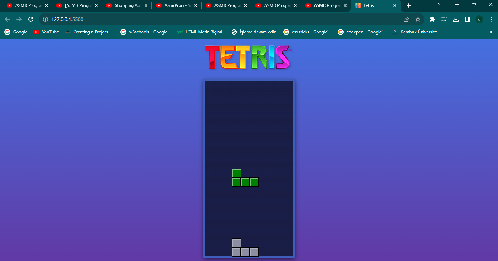
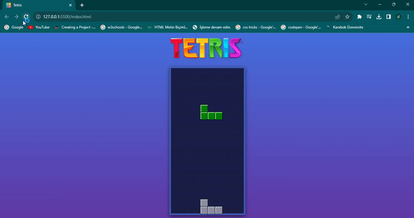

# Tetris
Tetris Oyunu Bu, HTML, CSS ve JavaScript kullanılarak oluşturulan bir Tetris oyunu web uygulamasıdır. 
Oyun başladığında, klavyenizdeki yön tuşlarını ile blokları hareket ettirip çevirebilirsiniz.

Oyunun amacı, düşen blokları sıralayarak Aşırı çizgeler oluşur

Oyuncu puanı ve oyun iler

Oyundan çıkmak için pencereyi kapatabilir veya belirli bir tuşla öğrenmeyi kullanabilirsiniz (genellikle Esc tuşu).

 

 
        
       
       
     
